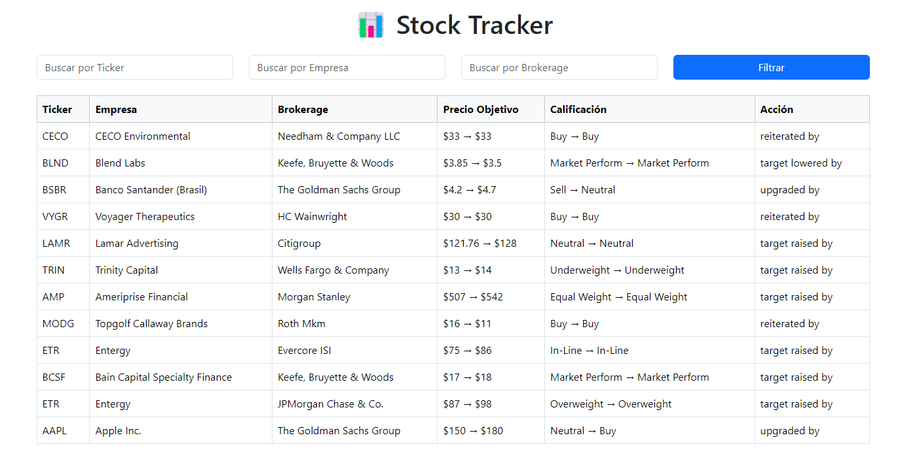
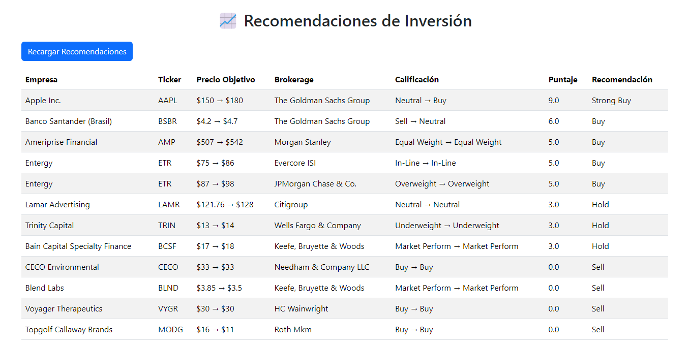

# Stock Tracker Frontend
---

## Technologies Used
- **Vue 3**: Modern JavaScript framework for building user interfaces.
- **TypeScript**: Strongly typed JavaScript for better maintainability.
- **Pinia**: State management solution for Vue.
- **Tailwind CSS**: Utility-first CSS framework for styling.
- **Vite**: Fast development server and build tool for Vue.
- **Axios**: HTTP client for consuming the backend API.

---

## 📂 Project Structure

```
frontend/
│── src/
│   ├── assets/              # Images and styles
│   ├── components/          # Vue components
│   │   ├── StockList.vue          # Stock listing with filters
│   │   ├── StockRecommendations.vue # Investment recommendations
│   ├── stores/              # State management (Pinia)
│   │   ├── stocks.ts        # Store for stocks
│   ├── views/               # (Optional) Main views
│   ├── App.vue              # Root component
│   ├── main.ts              # Entry point of the application
│   ├── style.css            # Global styles
│── public/                  # Static files
│── package.json             # Dependencies
│── vite.config.ts           # Vite configuration
│── README.md                # Documentation
```

---

## Prerequisites
Before running the frontend, ensure you have:

- **Node.js** (v18 or later) installed.
- **pnpm** installed globally:
  ```sh
  npm install -g pnpm
  ```
- The backend running at `http://localhost:9090`.

---

## Installation and Execution
### 1️. Dowload the repository
```sh
In this case we download the repository from the email
```

### 2️. Install dependencies
```sh
pnpm install
```

### 3️. Set up environment variables
Create a `.env` file in the `frontend/` folder with the following content:
```sh
VITE_API_BASE_URL=http://localhost:9090
```

### 4️. Run in development mode
```sh
pnpm run dev
```
This will start the server at `http://localhost:5173/`.

---

## Screenshots

### Stock List Page


### Stock Recommendations


---

## Technical Considerations
- The application uses **Vue 3 with Composition API** to manage component logic.
- **Pinia** is used instead of Vuex for state management due to its simplicity and performance benefits.
- **Axios** is used to fetch data from the backend, implementing error handling.
- The UI is built with **Tailwind CSS**, following a utility-first approach for styling.
- The application follows **modular architecture** to ensure maintainability and scalability.
- Filters are applied dynamically to fetch only the necessary data.

---

## 📄 License
This project is for technical evaluation purposes and can be extended for improvements.

---

## ✉️ Contact
Contact me at `samirgg2000@gmail.com`.